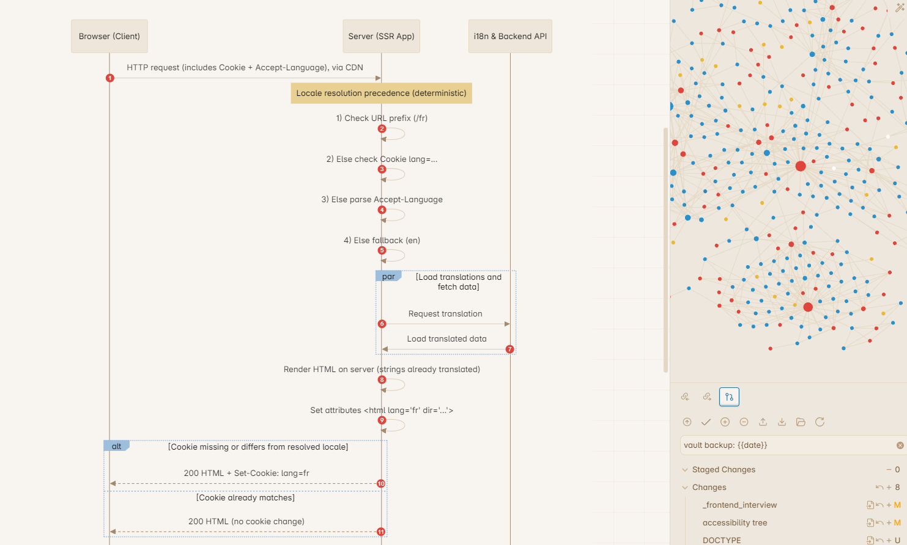

## CSS snippet to stylize mermaid diagram for primary theme
This snippet is written for obsidian. It's for users who hate the
mermaid visual and wish to stylize it to mirror the [primary theme](https://github.com/primary-theme/obsidian),
same as me. 

The plugin [mermaid-themes](https://github.com/jvsteiner/mermaid-themes?tab=readme-ov-file)
allows mermaid theme from the [official documentation](https://mermaid.js.org/config/theming.html),
but I need to mirror the Obsidian theme's design for consistency.

It is written piece by piece, so a lot of diagrams in mermaid might not be supported.
Currently, flowchart and sequence diagram is supported.

### Flowchart

### Sequence Diagram

### More WIP
...
## Reference
- [mermaid-js](https://github.com/mermaid-js/mermaid/tree/9745f325cb9e1967640f0e85da193a2f820634f1)
- [Resizable mermaid diagram in obsidian](https://forum.obsidian.md/t/let-the-user-decide-the-size-and-alignment-of-mermaid-diagrams/7019/22)
